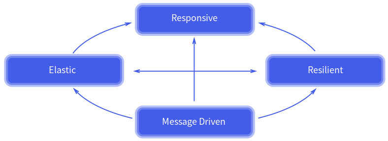

# Reactive Programming
Reactive Programing(RP)은 데이터 스트림과 변화의 전파에 대해 고려하는 선언적인 프로그램밍 패러다임이다.   
이 패러다임은 array와 같은 static 또는 event emitter와 같은 dynamic 데이터 스트림을 쉽게 표현할 수 있도록 만들어주고,     
연관된 실행 모델 내에서 추론된 dependency가 존재함을 알려 변경된 데이터 흐름의 자동 전파를 용이하게 한다. 간단하게 말하면,   
비동기 데이터 스트림으로 프로그래밍하는 방식이다.   
 
아준 간단하게 a=b+c라는 코드를 명령형 프로그래밍 방식과 리엑티브 프로그래밍 방식으로 비교해 보면,   
명령형 프로그래밍 방식에서는, a에 b+c의 결과가 할당된다. 할당된 b와 c는 a의 값에 그 어떠한 영향도 끼치지 않고 변경될 수 있다.   
반면에 리액티브 프로그래밍에서는 a는 b와 c의 값이 변경될 때마다 프로그램이 a=b+c 문을 다시 실행하지 않고도 자동으로 업데이트되어   
현재 할당된 a의 값을 결정하게 된다. 이런 것이 바로 Reactive Programing이다.    
 
Reactive Programming은 기본적으로 변수든 속성이든, 캐시, 데이터 구조, 이벤트 등등 모든 것을 스트림(Stream)으로 보고, 모든   
데이터의 흐름을 시간 순서에 의해 전달되는 스트림으로 처리한다. 여기에서 스트림은 시간 순서에 의해 전달된 값들의 collection   
혹은 나열이라고 생각하면 된다. 각각의 스트림은 새로 만들어질 수도 있고, 여러 개의 스트림이 합쳐(merge) 질 수도, 필터링이   
되거나 스트림이 다른 스트림의 input이 될 수도 있다. map, filter와 같은 함수형 메서드를 이용하여 immutable하게 처리할 수 있다.   
reference) http://www.reactive-streams.org https://en.wikipedia.org/wiki/Reactive_Streams   
 
Reactive Programming은 하나의 문제를 각각 비동기와 논블로킹 방식으로 실행될 수 있는 여러 단계로 분리할 수 있다.   
그리고 무한한 입력이나 출력을 생성할 수 있는 작업흐름(workflow)을 만들기 위해 결합한다. 비동기는 클라이언트에서 서비스로 전송된   
요청이 이후 임의의 시점에 처리된다는 의미인데, 이것은 논블럭킹을 가능하게 하는 리액티브 프로그래밍에서 굉장히 중요한 기술이다.   
실행 스레드들이 공유 자원을 점유하기 위해 경쟁할 때(현재 수행하는 일이 끝날 때까지 실행 스레드의 실행을 막는) 블럭킹으로 기다릴   
필요가 없는 것이다. 대신 자원을 점유하기 전까지 다른 유용한 작업을 수행할 수 있다. 
 
블럭킹 방식은 비동기 데이터처리가 끝날 때까지 스레드를 대기시키거나 콜백을 받아서 처리하기 때문에 불필요한 컴퓨터 리소스 사용이   
발생한다. 반면에 메시지 기반의 Reactive Programming 에서는 필요한 경우에만 스레드를 생성 후 메시지 형태로 전달하기 때문에 더   
효율적으로 컴퓨터 리소스를 사용할 수 있다.   

# Reactive 4가지 원칙 
Reactive Application은 아래 그림과 같이 네 가지 기본 원칙에 기반한다. 

1) 즉각 반은. 반응성(Responsive)   
2) 탄력성(Resilient)
3) 유연성(Elastic)
4) 메시지 중심(Message-driven)

# Pros and Cons
[Pros]   
- 멀티 코어, 멀티 CPU 하드웨어에서 연산 자원 활용의 증가
- 직렬화 지점을 감소시켜 성능을 향상
- 콜백 지옥에서 탈출
- 스레드 관리 용이
- backpressure. 과도한 사용과 무한한 자원 소비를 회피.

[Cons]   
- 가파른 학습곡선   
  다양한 오퍼레이션 제공   
  멀티스레드와 함수형 프로그리밍에 대한 개념 이해 필수
- 디버깅이 어려움   

# RP, FP, FRP(Functional Reactive Programming)
- Reactive Programming(RP)
비동기 데이터 스트림을 이용한 프로그래밍이다. 비동기 데이터 스트림에서 일어나는 변화를 지속적으로 관찰하고 이에 따른 동작을 수행해야 한다.  
- Functional Programming(FP)
자료 처리를 수학적 함수의 계산으로 취급하고 상태와 가변 데이터를 멀리하는 프로그래밍 패러다임의 하나이다. 어떤 문제를 해결하기 위해서 그 과정이나 공식에 치중하기보다는 이미 만들어지 함수의 응용을 강조한다.   
FP는 고계함수(higher-order functions)를 다루며, 1급 객체(first-class)로 간주한다. 그래서 FP는 동일한 매개 변수ㅡㄹ 사용하여 함수를 호출할 때마다 동일한 결과를 반환한다.   
이를 달성하기 위해서는 FP는 어떠한 상태도 가져선 안되고 있는 FP가 immutable 함을 보장한다. 
- Functional Reactive Programming(FRP)
RP에서 FP에서 제공하는 함수를 활용하는 것이다. 위 두가지 개념을 염두에 두고 FRP의 개념을 보자면, 입력에 대해 직접적인 선언적 방식으로 모델링하는 것이다.   
FRP의 모델은 이벤트와 행동이라는 두 가지 데이터 유형을 도입하여 시간이 지남에 따라 변화합니다. 이벤트는 특정 시간의 값이며, 동작은 시간이 지남에 따라 지속적으로 변하는 값을 의미한다.   
이러한 개념을 기능적 방식으로 결합하면 전체 프로그램이 이벤트와 행동의 결합이 된다. FRP는 코드의 추상화 수준을 높이므로 구현 세부사항을 둘러보는 대신 비즈니스 논리를 정의하는 이벤트와 상호 의존성에 집중할 수 있다.    
즉,   
RP = 데이터 스트림을 처리하여 코드의 변경 내용을 전파하는 비동기 프로그래밍 패러다임   
FP = 자료의 처리를 부작용 없이 수학적 함수로 취급하는 프로그래밍 패러다임   
FRP = FP의 기본 요소들을 사용하는 Reactive Programing 패러다임   
 
- Rx(ReactiveX)
관측 가능한(Observable) 스트림을 이용한 비동기, 이벤트 기반 프로그래미을 위한 라이브러리이자 API이다. Observer 패턴과 Iterator 패턴, 그리고 functional programming의 최고의 아이디어를 결합한 것이라고 말한다.   
Rx를 FRP라고 부르는 경우가 종종 있는데, 이는 잘 못된 것이다. Rx는 FRP를 할 수 있게 도와주는 API를 제공하고 있으므로 FRP의 장단점이 곧 Rx의 장단점이 될 수도 있다.   
Rx에서는 RP의 비동기 데이터 스트림을 Observable이라는 용어로 표현한다. 이 Observable은 변화를 지속적으로 관찰하고 이에 따른 동작을 수행하는데 그치지 않고 필터링, select 변환, 결합 등 여러 함수(Operators)를 이용할 수 있다.