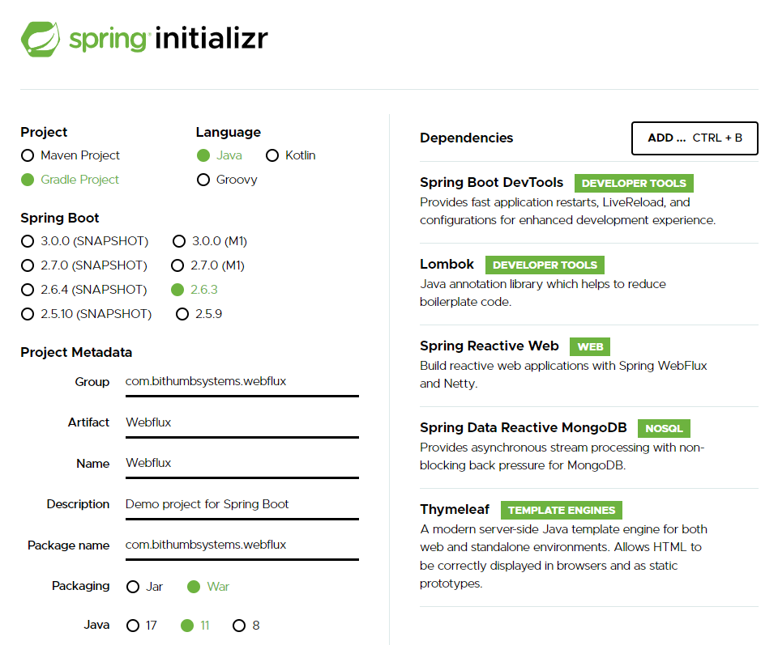

# Spring initializer를 이용한 프로젝트 생성
spring initializr를 통해 프로젝트를 생성해서 zip 파일을 만들고, eclipse에서 import 하는 방식으로 프로젝트를 생성한다.   
https://start.spring.io/에 접속하여 아래와 같이 작성한다.   

Gradle Project를 선택해서 생성할 수 있도록 한다.   
<b>Project Metadata</b>   
- group: com.bithumbsystems.webflux
- Artiface: SystemsWebflux
- Package name : com.bithumbsystems.webflux
- Java : 11   
<b>Dependencies</b>
- Spring Boot DevTools
- Lombok
- Spring Reactive Web
- Spring Data Reactive MongoDB
- Thymeleaf   
# build.gradle
spring initializr에서 생성한 프로젝트를 import하면 아래와 같은 build.gradle이 생성된 것을 확인할 수 있다.   
```gradle
plugins {
	id 'org.springframework.boot' version '2.6.3'
	id 'io.spring.dependency-management' version '1.0.11.RELEASE'
	id 'java'
	id 'war'
}

group = 'com.bithumbsystems.webflux'
version = '0.0.1-SNAPSHOT'
sourceCompatibility = '11'

configurations {
	compileOnly {
		extendsFrom annotationProcessor
	}
}

repositories {
	mavenCentral()
}

dependencies {
	implementation 'org.springframework.boot:spring-boot-starter-data-mongodb-reactive'
	implementation 'org.springframework.boot:spring-boot-starter-thymeleaf'
	implementation 'org.springframework.boot:spring-boot-starter-web'
	implementation 'org.springframework.boot:spring-boot-starter-webflux'
    implementation 'org.synchronoss.cloud:nio-multipart-parser'
	compileOnly 'org.projectlombok:lombok'
	developmentOnly 'org.springframework.boot:spring-boot-devtools'
	annotationProcessor 'org.projectlombok:lombok'
	providedRuntime 'org.springframework.boot:spring-boot-starter-tomcat'
	testImplementation 'org.springframework.boot:spring-boot-starter-test'
	testImplementation 'io.projectreactor:reactor-test'
}

tasks.named('test') {
	useJUnitPlatform()
}
```
- spring-boot-starter-webflux: Reactive Web Dependency를 추가하면 생성되는 것으로 Reactive Spring Web 어플리케이션을 생성하기 위한 기반이 되는 Dependency이다.   
Embedded Netty를 포함하고 있고, Server는 별도로 tomcat과 같은 dependency를 추가하여 변경할 수 있다.   
- spring-boot-starter-thymeleaf: Thymeleaf의 template engine
- spring-boot-starter-test: 프로젝트를 생성하면 스프링 부트는 기본적으로 테스트 dependency를 포함시키는데, 이 Dependency는 JUnit, Spring Boot Test, Mockito, AssertJ, JSONassert, Hamcrest 등의 테스트 라이브러리를 포함하는 컬렉션
- nio-multipart-parser: Synchronoss의 third-party 라이브러리로, 리액티브한 multipart file 업로드를 지원한다.

# SpringBootApplication.class
```java
package com.bithumbsystems.webflux;

import org.springframework.boot.SpringApplication;
import org.springframework.boot.autoconfigure.SpringBootApplication;

@SpringBootApplication
public class SystemsWebfluxApplication {
	public static void main(String[] args) {
		SpringApplication.run(SystemsWebfluxApplication.class, args);
	}

}
```
@SpringBootApplication은 아래와 같은 세 가지 annotation의 기능을 수행한다. 
- @Configuration: applicationContext를 위해 bean을 정의하는 source 역할 class. 즉 Spring의 설정 파일 역할을 하는 클래스임을 알려준다.
- @EnableAutoConfiguration: Spring Boot가 classpath setting, 또 다른 beans, 그리고 다양한 property settings에 기초하여 bean들을 등록하도록 지시한다.
- @ComponentScan: Spring이 다른 components, configurations, services을 확인하도록 지시한다.   
ComponentScan의 기능이 제대로 동작하기 위해서는 이 어노테이션이 선언된 클래스는 패키지 최상위에 위치하게 된다.   
 # application.yaml
 ```yaml
server:
  port: 8080
# logging
logging:
  level:
    com:
      bithumbsystems:
        webflux: DEBUG
    org:
      springframework:
        data: TRACE
    reactor:
      core: TRACE
      util: TRACE
```