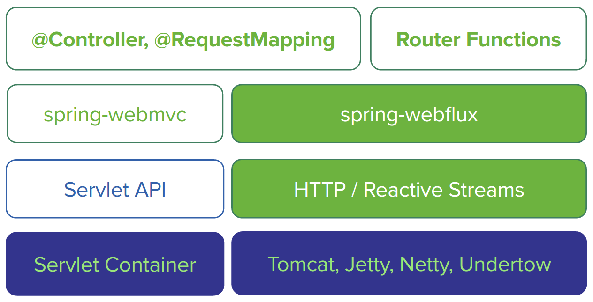
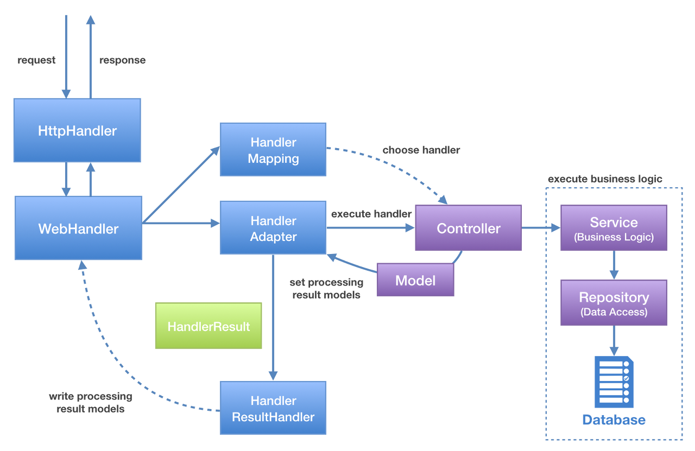

# WebFlux로 Reactive Service Bean 구성
## Reactive Spring WebFlux vs Spring MVC
Spring MVC는 Java EE의 Servlet spec에 기반하여 만들어져 있고, 이는 본질적으로 블럭킹이고 동기방식이다. 비동기 처리 기능이 스프링 프레임워크 3에서 추가되어 지원된다고 하지만, 서블릿은 응답을 기다리는 동안 pool의 스레드들을 여전히 지연시킬 수 있기 때문에, 전체 stack이 reactive 해야 하는 요구를 충족시킬 수 없다. 이러한 요구사항에 맞추어 스프링 플임워크 5에 도입된 대안적인 모듈이 바로 Webflux로써, 웹 요청을 reactive 하게 다루는 데에 초점이 맞추어져 있다.
### 1) 구조

MVC는 서블릿 컨테이너와 서블릿을 기반으로 웹 추상화 계층을 제공하는데 반해, WebFlux는 서블릿 컨테이너 뿐만 아니라, Netty, Undertow와 같은 네트워크 어플리케이션 프레임워크도 지원하므로, HTTP와 Reactive Stream 기반으로 웹 추상화 계층을 제공한다.   
그래서 WebFlux 모듈에는 HTTP abstractions, Reactive Stream adapter, Reactive codes 그리고 non-blocking servlet api를 지원한느 core web api가 포함되어 이다. 때문에 server-side WebFlux 상에서 아래와 같이 두 가지 프로그램 모델로 구성이 가능하다.
- Annotated Controller: Spring MVC 모델 기반의 기존 sping-web 모듈과 같은 방식으로 구성하는 방법으로, Spring MVC에서 제공하는 어노테이션들을 그대로 사용 가능하다.
- Functional Endpoints: Java 8 lambda style routing과 handling 방식이다. 가벼운 routing기능과 request 처리 라이브러리라고 생각하면 쉽고, callback 형태로서 요청이 있을 때만 호출된다는 점이 annotated controller 방식과의 차이점이다.
### 2) 동작 흐름
Spring MVC의 처리 흐름은 서블릿 컨테이너로 들어온 요청이 디스패처 서블릿으로 전달되면, 디스패치 서블릿은 순차적으로 HandlerMapping, HandlerAdapter에 요청에 대한 처리를 위임하고, ViewResolver에 응답에 대한 처리를 위임하는 방식이다.   
Spring WebFlux도 이와 그케 다르지는 않다.   

웹 서버(Servlet Container나 Netty, Undertow 등)로 들어온 요청이 HttpHandler에서 전달되면 HttpHandler는 전처리 후 WebHandler에 처리를 위임하게 된다. 이 WebHandler 내부에서 HandlerMapping, HandlerAdapter, HandlerResultHandler 3개의 컴포넌트가 요청과 응답을 처리하게 된다. 처리가 끝나면 HttpHandler가 후처리 후 응답을 종료한다. 여기에서 보듯 Spring MVC와 HandlerMapping, HandlerAdapter라는 컴포넌트가 동일하게 존재하는 것을 볼 수 있는데, 유의할 점은 컴포넌트의 이름과 역할은 동일하지만 동작 방식이 달라, 서로 다른 인터페이스를 사용한다.   
- MVC
  - org.springframework.web.servlet.HandlerMapping
  - org.springframework.web.servlet.HandlerAdapter
- WebFlux
  - org.springframework.web.reactive.HandlerMapping
  - org.springframework.web.reactive.HandlerAdapter

# Domain 객체 생성
```java
package com.bithumbsystems.webflux.domains;

import org.springframework.data.annotation.Id;
import org.springframework.data.mongodb.core.mapping.Document;
import lombok.AllArgsConstructor;
import lombok.Data;
import lombok.NoArgsConstructor;
import lombok.ToString;

@Data
@Document
@NoArgsConstructor
@AllArgsConstructor
public class Image {
    @Id private String id;
    private String name;

    public Image(String id) {
        this.id = id;
    }
}
```
id와 name이라는 프로퍼티를 가진 객체로, 몇 가지 lombok 어노테이션이 붙어 있다.    
lombok은 에디터나 빌드 툴에 자동으로 연결되는 자바 라이브러리로, bean 객체에 setter/getter/toString/hashCode/equals 등과 같이 꼭 필요하지만 클래스 파일의 소스를 길어지게 만들고, 번거롭게 작성하도록 만드는 코드들을 없애주기 위해 만들어졌다.
- @Data : 클래스 내의 모든 private 필드에 대해 @Getter, @Setter, @ToString, @EqualsAndHashCode, @RequiredArgsConstructor를 지정해주는 어노테이션이다.
- @Getter, @Setter: 필드에 대한 getter/setter 메서드를 생성
- @ToString: toString 메서드 생성
- @EqualsAndHashCode: equals 메서드와 hashcode 메서드 생성
- @RequiredArgsconstructor: 모든 초기화되지 않은 final 변수, @NotNull 어노테이션이 붙은 초기화되지 않은 필드를 파라미터로 받는 생성자를 생성해 주는 어노테이션으로, @NotNull이 붙은 필드에 대해서는 명시적으로 null 체크에 대한 코드를 추가하여 준다.
- @NoArgsConstructor : 파라미터가 없는 기본 생성자를 생성해 주는 어노테이션
- @AllArgsConstructor: 모든 필드를 파라미터로 받는 생성자를 생성해 주는 어노테이션.   

여기서 유의할 점은 @Document와 @Id는 lombok의 어노테이션이 아니다. 이 어노테이션은 Spring Data의 어노테이션이다.   
# ImageService 생성하기
```java
@Service
public class ImageService {
    public static String UPLOAD_PATH = "tmp";

    private final ResourceLoader resourceLoader;
    public ImageService(ResourceLoader resourceLoader) {
        this.resourceLoader = resourceLoader;
    }
}
```
- @Service: 이 객체가 Service로서 사용되는 Spring bean임을 가리킨다. Spring boot는 자동으로 이 클래스를 스캔하고, 인스턴스를 생성한다.
- UPLOAD_PATH : 저장 폴더
- ResourceLoader: 파일들을 관리하기 위해 사용되는 Spring Utility class. Spring Boot에 의해 자동으로 생성되고 생서자 주입을 통해 service로 주입된다.   

```java
    @Bean
    CommandLineRunner setUp() throws IOException {
        return (args) -> {
            FileSystemUtils.deleteRecursively(new File(UPLOAD_PATH));
            Files.createDirectory(Paths.get(UPLOAD_PATH));
            FileCopyUtils.copy("file1", new FileWriter(UPLOAD_PATH + "/file1.jpg"));
            FileCopyUtils.copy("file2", new FileWriter(UPLOAD_PATH + "/file2.jpg"));
            FileCopyUtils.copy("file3", new FileWriter(UPLOAD_PATH + "/file3.jpg"));
        };
    }
```
- @Bean: ImageService가 생성될 때 Spring bean으로 등록되는 객체를 반환할 것임을 지시한다.   
- 이 bean의 반환값은 CommandLineRunner으로서, 이는 Spring Application이 구동될 때 실행되는 특수한 인터페이스이다. 그러므로 Spring Boot는 어플리케이션 컨텍스트가 완전히 realize 된 후에 모든 CommandLineRunner들을 run 한다.
- 이 메서드는 Java 8 lmabda를 사용하였고, Java 8 SAM(Single Abstract Method) 규칙을 통해 CommandLineRunner로 자동으로 변환된다.      

위에서 테스트 데이터를 만들었으니 이제 실제로 CRUD 메서드를 작성한다. 먼저, 모든 이미지들을 가져와 반환하는 findAllImages 메서드이다.   
```java
    public Flux<Image> allImages() {
        try {
            return Flux.fromIterable(
              Files.newDirectoryStream(Paths.get(UPLOAD_PATH))
            ).map(path -> new Image(Integer.toString(path.hashCode()), path.getFileName().toString()));
        }catch(IOException e) {
            return Flux.empty();
        }
    }
```
- 이 메서드는 Flux<Image>를 반환하므로, image들의 컨테이너는 consumer가 subscribe 할 때 생성되어 얻어지게 된다.
- Files는 nio 패키지의 reactive 파일 처리 클래스이다. Files.newDirectoryStream 메서드는 UPLOAD_PATH 경로에 lazy한 DirectoryStream을 열기 위해 사용된다. DirectoryStream은 next() 메서드가 호출될 때가지 해당 디렉토리(recursive하지 않으므로 자식 파일만 가져옴) 내 파일을 가져오지 않아, Reactor Flux에 가장 적합하다.
- Flux.fromIterable은 이 lazy iterable을 래핑 하는 데 사용되고, 래핑함으로써 reactive streams client가 각각 item을 요구했을 때 가져오도록 만들어준다.
- 만약 Image가 존재하지 않는 등의 이유로 Exception이 발생하면 이 메서드는 빈 Flux를 반환한다.    

이미지 전체를 가져오는 것뿐만 아니라, 각각 이미지를 가져오는 코드는 아래와 같다.    
```java
    public Mono<Resource> getOneImage(String filename) {
        return Mono.fromSupplier(() ->
                resourceLoader.getResource(
                        "file:" + UPLOAD_PATH + "/"+ filename
                ));
    }
```
- 하나의 이미지만을 다루기 때문에 이 메서드는 Mono<Resource>를 반환한다. 여기서 Resource는 파일을 위한 스프링의 추상 타입이다.
- 클라이언트가 subscribe 할 때까지 파일을 가져오는 것을 지연시키기 위해서, Mono.fromSupplier 메서드로 전체 코드를 래핑하고, getResource 메서드는 lambda 내부에 구현했다.   

아래는 이미지를 생성하는 부분이다.
```java
    public Mono<Void> uploadImage(Flux<FilePart> files) {
        return files.fileMap(file -> file.transferTo(
                Paths.get(UPLOAD_PATH, file.filename()
        ).toFile())).then();
    }
```
- 이미지를 생성하기만 하는 메서드이므로, 아무것도 반환하지 않는 Mono<Void>를 return value로 지정했다.
- FilePart 객체의 Flux를 인자로 받아 flatMap을 사용하여 각각에 대해 처리를 한다.
- 각각의 파일은 비어있지 않다는 것을 보장하기 위해 테스트된다.
- FilePart의 content는 UPLOAD_PATH에 새로운 파일로서 저장된다.
- then() 메서드는 전체 Flux가 끝날 때까지 기다렸다가 Mono<Void>를 생산하도록 만들어준다.   

다음은 삭제하는 메서드이다.
```java
    public Mono<Void> deleteImage(String filename) {
        return Mono.fromRunable(() -> {
           try {
               Files.deleteIfExists(Paths.get(UPLOAD_PATH, filename));
           }catch(IOException e) {
               throw new RuntimeExcetpion(e);
           }
        });
    }
```
- 생성과 마찬가지로 return value에 관심이 없는 메서드이므로 Mono<Void>를 반환한다.
- subscribe 될 때까지 기다리기 위해, Mono.fromRunnable 메서드를 이용하여 래핑할 필요가 있으며, lambda expression을 사용하여 Runnable을 강제 실행시킨다.
- Java.NIO의 Files.deleteIfExists 메서드를 사용하여 간단하게 삭제할 수 있다.   

```java
@Service
public class ImageService {
    public static String UPLOAD_PATH = "tmp";

    private final ResourceLoader resourceLoader;
    public ImageService(ResourceLoader resourceLoader) {
        this.resourceLoader = resourceLoader;
    }

    @Bean
    CommandLineRunner setUp() throws IOException {
        return (args) -> {
            FileSystemUtils.deleteRecursively(new File(UPLOAD_PATH));
            Files.createDirectory(Paths.get(UPLOAD_PATH));
            FileCopyUtils.copy("file1", new FileWriter(UPLOAD_PATH + "/file1.jpg"));
            FileCopyUtils.copy("file2", new FileWriter(UPLOAD_PATH + "/file2.jpg"));
            FileCopyUtils.copy("file3", new FileWriter(UPLOAD_PATH + "/file3.jpg"));
        };
    }

    public Flux<Image> allImages() {
        try {
            return Flux.fromIterable(
              Files.newDirectoryStream(Paths.get(UPLOAD_PATH))
            ).map(path -> new Image(Integer.toString(path.hashCode()), path.getFileName().toString()));
        }catch(IOException e) {
            return Flux.empty();
        }
    }

    public Mono<Resource> getOneImage(String filename) {
        return Mono.fromSupplier(() ->
                resourceLoader.getResource(
                        "file:" + UPLOAD_PATH + "/"+ filename
                ));
    }

    public Mono<Void> uploadImage(Flux<FilePart> files) {
        return files.fileMap(file -> file.transferTo(
                Paths.get(UPLOAD_PATH, file.filename()
        ).toFile())).then();
    }

    public Mono<Void> deleteImage(String filename) {
        return Mono.fromRunable(() -> {
           try {
               Files.deleteIfExists(Paths.get(UPLOAD_PATH, filename));
           }catch(IOException e) {
               throw new RuntimeExcetpion(e);
           }
        });
    }
}
```
# ImageController 생성하기
ImageController에는 다음과 같은 필드와 생성자가 필요하다.   
```java
@Controller
public class ImageController {
    private static final String BASE_PATH = "/images";
    private static final String FILENAME = "{filename:.*}";
    
    private final ImageService imageService;
    
    public ImageController(ImageService imageService) {
        this.imageService = imageService;
    }
    
    ...
}
```
- @Controller: WebFlux는 MVC와 동일한 어노테이션을 사용
- BASE_PATH : imageService를 화면에 나타내기 위해 설정해 준 기본 경로
- filename : 이미지를 가져오는데 사용될 키 값
- ImageService : 생성자 주입을 통해 ImageController에 ImageService가 주입   

ImageService의 기능을 사용하는 요청별로 메서드를 정의한다.   
```java
    @GetMapping(value = BASE_PATH + "/view/" + FILENAME, produces = MediaType.IMAGE_JPEG_VALUE)
    @ResponseBody
    public Mono<ResponseEntity<?>> oneImage(@PathVariable String filename) {
        return imageService.getOneImage(filename)
                .map(resource -> {
                   try {
                       return ResponseEntity.ok()
                               .contentLength(resource.contentLength())
                               .body(new InputStreamResource(
                                       resource.getInpuStream()
                               ));
                   }catch(IOException e) {
                       return ResponseEntity.badRequest()
                               .body("Counldn't find " + filename + " => " + e.getMessage());
                   }
                });
    }
```
- @GetMapping: Get 방식의 BASE_PATH/filename/raw 라는 경로로 들어오는 요청을 받아들이며, Content-Type header를 image에 맞게 적절히 렌더링
- @ResponseBody: 이 메서드의 response가 바로 HTTP response body로 쓰일 것임을 지시
- @PathVariable: filename이라는 input이 경로로 들어온 {filename} 속성으로부터 추출된다는 것을 의미
- Mono<ResponseEntity<?>>: 하나의 response를 reactive 하게 반환하는 것을 의미하며, ResponseEntity<?>는 일반적으로 HTTP response를 의미
- 이 메서드는 내부적으로 ImageService의 findOneImage(filename) 메서드를 호출.
- findOneImage는 Mono<Resource>를 리턴하기 때문에, map을 통해서 Resource를 response header의 Content-Length 뿐만 아니라 body에 내장된 데이터까지 포함하는 ResponseEntity로 변환
- 예외가 발생하면 HTTP Bad Response를 반환   

위의 짧은 코드에서 Reactive Spring이 제공하는 많은 특징들을 살펴 볼 수 있다. route handling, 독립된 서비스에 위임하기, response를 클라이언트에 적합한 포멧으로 변환하기, 예외 처리까지.   
위의 코드는 reactive하게 수행된다. HTTP OK/HTTP BAD REQUEST response를 생성하는 것은 map()이 실행될 때까지 수행되지 않는다. 이것은 파일을 디스크로부터 가져오는 ImageService의 메서드와 연결되어 있다. 클라이언트가 subscribe 하기 전까지는 그 어떤 것도 행해지지 않습니다. 이 경우에 subscribing은 요청이 들어왔을 때 프레임워크에 의해 다루어진다.   

참고.컨트롤러는 경량으로 유지되어야 한다고 언급했던 것과 반대되게, 위의 코드는 썩 경량인 것처럼 보이지 않는다. 그러나, 컨트롤러를 더 가볍게 만들기 위해서 ResponseEntity를 래핑하여 imageService로 옮기는 것은 잘못된 선택이다. ImageService는 web layer에 대해서는 그 어떤 것도 알 필요가 없기 때문이다. 컨트롤러가 주시하는 것은 웹 클라이언트에게 보이는 데이터를 만드는 것이고, ResponseEntity를 만드는 것은 컨트롤러가 해야 할 일이지, ImageService가 해야 할 일이 아니다.   

아래는 새로운 파일들을 업로드하는 메서드이다.
```java
    @PostMapping(value = BASE_PATH)
    public Mono<String> createFile(@RequestPart(name = "file") Flux<FilePart> files) {
        return imageService.createImage(files)
                .then(Mono.just("redirect:/"));
    }
```
- 입력값은 들어오는 FilePart 객체의 collection은 Flux로 표현됨 
- 파일들의 flux는 진행되는 중에 imageService로 즉시 전달(input으로 받아들임과 동시에 전달)
- then()은 메서드가 완료되면 redirect:/ 지시문을 반환(Mono로 래핑)하게 되고, HTML은 /로 redirect됨.   

여기서 꼭 기역해야 하는 것은 파일들의 flux에 대해서 then()을 하지 않는다는 점이다. 그 대신 ImageService는 모든 파일의 처리가 완료되면 시그널을 보내는 Mono<Void>를 반환한다. redirect로 추가적인 연결을 이어주는 것은 Mono이다.   

다음은 Image를 삭제하는 요청을 처리하는 메소드이다.   
```java
    @DeleteMapping(BASE_PATH + "/delete/" + filename)
    public Mono<String> deleteFile(@PathVariable String filename) {
        return imageService.deleteImage(filename)
                .then(Mono.just("redirect:/"));
    }
```
- @DeleteMapping 어노테이션을 사용하고, 이는 HTTP DELETE 동작을 위한 준비가 되어 있음.
- BASE_PATH/filename 경로로 들어오는 요청을 받아들임
- ImageService의 deleteImage() 메서드를 호출.
- then()은 mono로 래핑된 redirect:/가 직접적으로 돌아오기 전까지 delete를 수행하지 않고 기다림.   

마지막으로 ImageController에 들어갈 메서드는 메인 페이지 역할을 할 root(/)로 연결하는 메서드를 정의한다. 
```java
    @GetMapping("/")
    public Mono<String> index(Model model) {
        model.addAttribute("images", imageService.allImages());
        return Mono.just("index");
    }
```
- Get 요청을 받아들임. PATH는 /
- Model 객체를 받아들이는 데 이는 우리가 데이터를 reactive하게 로드할 수 있도록 함
- addAttribute()는 ImageService의 findAllImages() 메서드가 반환하는 Flux를 템플릿 모델의 Image 속성으로 할당.
- Mono로 래핑된 index를 반환   

SpringBootApplication에 아래 코드를 추가해야 Delete 동작 수행시 에러가 발생하지 않는다. 
```java
	@Bean
	HiddenHttpMethodFilter hiddenHttpMethodFilter() {
		return new HiddenHttpMethodFilter();
	}
```
이는 DELETE가 HTML5 FORM에 유효한 동작이 아니기 때문이다. 그래서 위의 코드 없이 동작하게 되면, Thymeleaf는 원하는 verb가 포함된 hidden input filed를 생성한느데, 이는 HTML5 POST를 사용한다. 결국 웹 호출 중에 Spring에 의해 변형되어 @DeleteMapping 메서드가 적절히 호출되지 않게 되는 것이다.

REF: https://kellis.tistory.com/34?category=822186
